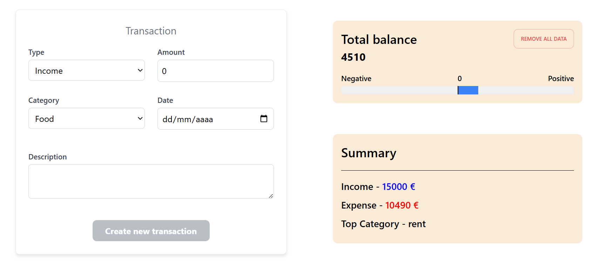
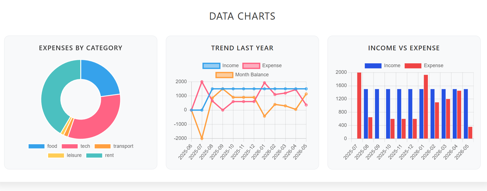
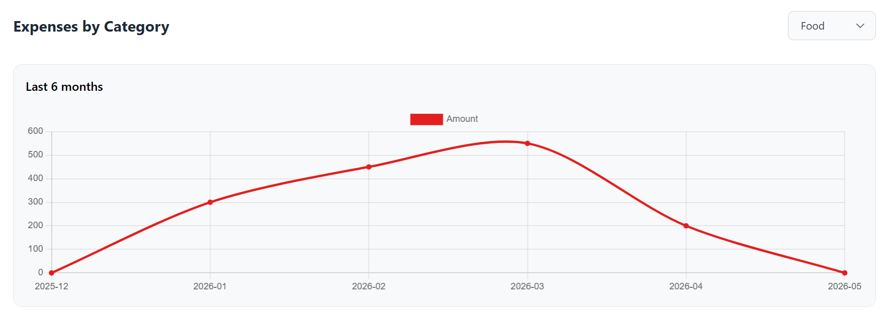
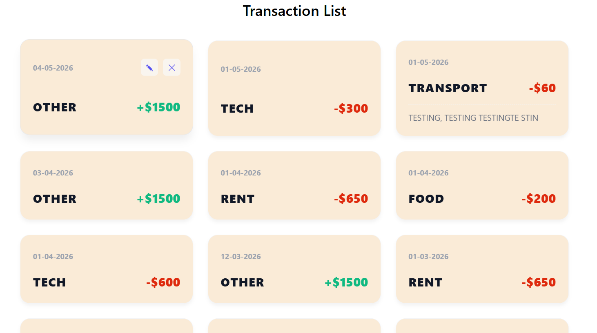
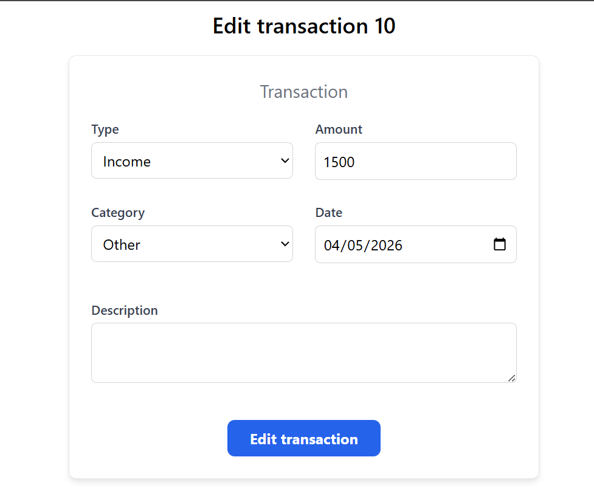

# Finance Dashboard

Personal finance dashboard built with Angular 19 using Signals, reactive forms, shared state management, and Chart.js.

## Features

- Add transactions
- Edit transactions
- Delete transactions
- Monthly analytics
- Expense categories
- Income vs expense charts
- Category trends
- Responsive dashboard
- Shared reactive state with Signals

## Tech Stack

- Angular 21
- TypeScript
- Signals
- Reactive Forms
- Chart.js
- ng2-charts

## Project Structure

The project is organized using standalone components and a centralized store approach.

Main areas:

- Dashboard
- Transactions
- Analytics & Charts
- Shared reusable components

## Project Goals

This project was created to practice:

- Angular Signals
- State management
- Reactive Forms
- Component architecture
- Data transformations with `map`, `reduce`, and `filter`
- Chart integrations
- Responsive UI design

## Screens

- Dashboard
  
  
  
- Transactions list
  
- Transaction edit page
  

## Run Locally

```bash
npm install
ng serve
```

## Future Improvements

Local storage / backend persistence
Authentication
Transaction filtering
Better chart customization
Unit tests

## Author

Created by Simón González
